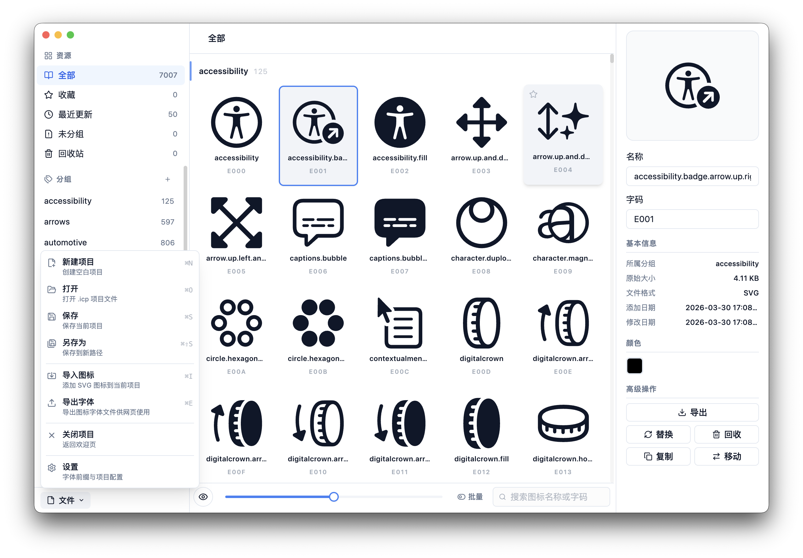
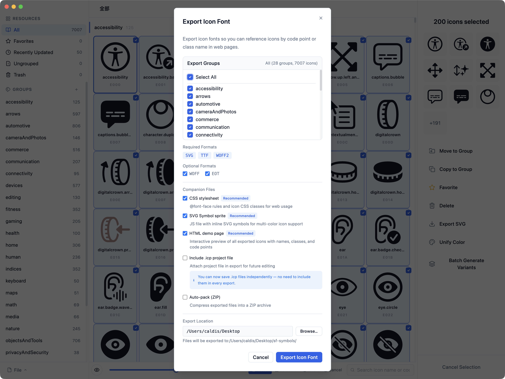
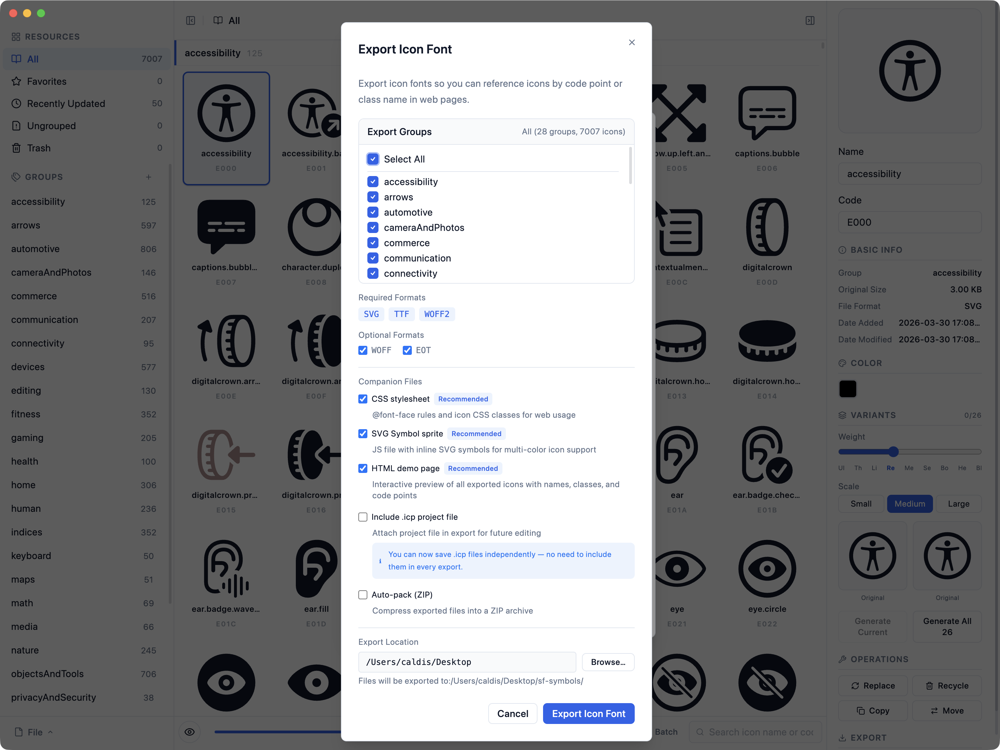

<p align="center">
  
</p>

<h1 align="center">Bobcorn</h1>

<p align="center">
  <strong>Open-source icon manager and icon font generator for Windows & macOS.</strong><br>
  Import SVGs, organize icon libraries, edit colors, and generate production-ready icon fonts (SVG, TTF, WOFF, WOFF2, EOT) — all in one app.
</p>

<p align="center">
  <a href="https://github.com/Caldis/bobcorn/releases/latest"></a>
  <a href="https://github.com/Caldis/bobcorn/releases"></a>
  <a href="LICENSE"></a>
  <a href="https://github.com/Caldis/bobcorn/actions"></a>
</p>

<p align="center">
  <a href="https://bobcorn.caldis.me"><strong>Website</strong></a> · <a href="https://github.com/Caldis/bobcorn/releases/latest"><strong>Download</strong></a> · <a href="https://github.com/Caldis/bobcorn/releases"><strong>Changelog</strong></a>
</p>

<p align="center">
  
</p>

---

## What is Bobcorn?

Bobcorn is a free, open-source desktop application for **icon management** and **icon font generation**. It helps designers and front-end developers organize large SVG icon libraries and generate production-ready icon fonts in every major format.

**Who uses it:** Individual designers, front-end developers, and enterprise teams (including ZTE and Shopee) who need to build and maintain custom icon font systems.

**How it compares:** Unlike browser-based tools like IcoMoon, Bobcorn is a native desktop app that handles large libraries (3,000+ icons) with fast local processing. Unlike macOS-only tools like IconJar, Bobcorn runs on Windows and macOS, and generates icon fonts — not just icon organization.

## Features

### Icon Management
- **SVG import** — Drag-and-drop or file dialog, batch import from folders
- **Group organization** — Create, reorder, copy, and move icon groups
- **Search & filter** — Instantly find icons across your entire library
- **Inline color editor** — Hex picker, eyedropper, or any CSS color format with live preview
- **Scales to thousands** — Handles 3,000+ icons smoothly

<p align="center">
  
</p>

### Icon Font Generation
- **One-click export** — Generate all font formats at once with real-time progress
- **Output formats** — SVG, TTF, WOFF, WOFF2, EOT font files
- **Web assets** — CSS (class & symbol), JS, and HTML demo page
- **Project files** — Save/reload `.icp` projects; exports include the project file automatically

<p align="center">
  
</p>

### General
- **Cross-platform** — Windows, macOS (Intel & Apple Silicon)
- **Dark mode** — One-click toggle, persisted across sessions
- **Open source** — MIT licensed, free forever

## Download

| Platform | Format | Link |
|----------|--------|------|
| Windows | `.exe` installer | [Download](https://github.com/Caldis/bobcorn/releases/latest) |
| macOS (Apple Silicon) | `.dmg` arm64 | [Download](https://github.com/Caldis/bobcorn/releases/latest) |
| macOS (Intel) | `.dmg` x64 | [Download](https://github.com/Caldis/bobcorn/releases/latest) |

## Export Formats

| Format | Type | Description |
|--------|------|-------------|
| `.svg` | Font | SVG font file |
| `.ttf` | Font | TrueType font |
| `.woff` | Font | Web Open Font Format |
| `.woff2` | Font | WOFF2 (compressed, recommended for web) |
| `.eot` | Font | Embedded OpenType (IE compatibility) |
| `.css` | Web | Stylesheet with class names and unicode mappings |
| `.js` | Web | JavaScript icon definitions |
| `.html` | Web | Demo page with all icons and usage examples |
| `.icp` | Project | Bobcorn project file (save/restore full state) |

## Tech Stack

| Layer | Technology |
|-------|-----------|
| Runtime | Electron 28 |
| UI | React 18 + Radix UI + Tailwind CSS + lucide-react |
| State | Zustand |
| Build | electron-vite (Vite-based) |
| Database | sql.js (SQLite compiled to WASM) |
| Types | TypeScript 5 |
| Test | Vitest (unit) + Playwright (E2E) |
| Packaging | electron-builder |

## Development

### Prerequisites

- Node.js 18+ (recommend [fnm](https://github.com/Schniz/fnm))
- npm 8+

### Quick Start

```bash
# Install dependencies
npm install --legacy-peer-deps

# Start dev server with HMR
npx electron-vite dev
```

### Build & Test

```bash
# Production build
npx electron-vite build

# Run tests
npx vitest run                  # Unit tests
node test/e2e/acceptance.js     # E2E acceptance (21 checks)
node test/e2e/full-e2e.js       # Full E2E flow (15 steps)
```

### Package

```bash
npm run package        # Current platform
npm run package-win    # Windows
npm run package-all    # All platforms
```

## License

MIT — see [LICENSE](LICENSE) for details.
